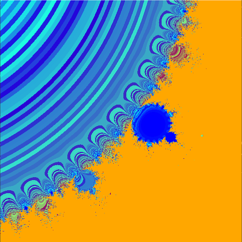

# Parallel Computing
马子轩 2019211119

清华大学 计算机系

## I. 实验环境
    我们的实验在集群gorgon上执行。gorgon集群包含9个节点。每个节点的配置如下

    CPU: Dual Intel(R) Xeon(R) CPU E5-2670 v3 @ 2.30GHz
    Memory: 128GB
    GPU: Nvidia Tesla V100
    NIC: ConnectX-4 EDR 100Gb/s InfiniBand MCX455A + EDR Switch

    OS: Ubuntu 16.04.4 LTS
    MPI: OpenMPI 3.0.0

## II. MPI实验
### 任务
    1. 生成一组数据，分配到不同的进程中。
    2. 通过并行IO将数据写入文件
    3. 将数据通过通讯传输到0号进程
    4. 比较数据

### 实现
    1. 我们通过MPI_FILE_write_at实现写入文件
    2. 通讯使用MPI_Gatherv实现收取数据
    3. 最后通过串行IO读取数据进行验证

### 执行
    代码: parallel.cpp
    
```shell
    mpicxx --std=c++11 parallel.cpp -o parallel
    mpirun -np 8 parallel
```

    注意: 程序由于需要写文件对比，因此执行只能在一台机器上执行,一定不可以在多个机器上执行。

    输出"OK!"代表程序运行正确。

### 结论
    
    验证成功，实验完成

## III. Random Reduction
### 任务
    1. 读懂并将串行算法reduction.cpp改成mpi并行。
    2. 用random_matrix.py生成随机矩阵，
    3. 用validationg_mpi.cpp验证结果。

### 实现
    实际算法类似于矩阵乘法的实现，在固定两维的情况下，对第三维做reduction。我们为了保证程序的局部性，对前两位合并后进行进程划分，分别计算后收取结果输出。

### 执行
    代码: reduction_mpi.cpp
    我们将测试过程写入脚本test.sh

```shell
    cd reduction
    ./test.sh
```

    输出"VALID!"证明验证成功。

### 结论
    对于类似于矩阵乘法的程序，我们对除最后一维外的部分进行划分，即可在保证局部性的情况下进行并行化。

## IV. Mdndelbrot
### 任务
    1. 将分形算法用OpenMP并行化
    2. 比较和分析1, 2, 4, 8 核的扩展性和加速性

### 实现
    首先，我使用C++风格重新实现了一次代码，并封装了复数类，方便后续修改，降低代码量。之后，在验证正确性后，删除了打印图的代码。由于我们需要验证可扩展性，因此运行规模较大，这种时候删除掉打印部分，能够提高运行速度。同时我们提高了计算的规模，增大了图片的分辨率。

    我们发现，程序对每个像素点，计算过程都是尴尬并行的。因此我们直接对像素点进行划分，使用OpenMP Parallel For进行并行化，即可轻易完成任务。

### 执行
    代码: mandelbrot.cpp

```shell
    cd mandelbrot
    g++ --std=c++11 -fopenmp mandelbrot.cpp -o mandelbrot
    ./mandelbrot -0.5 0.5 0.5 10000 1
    ./mandelbrot -0.5 0.5 0.5 10000 2
    ./mandelbrot -0.5 0.5 0.5 10000 4
    ./mandelbrot -0.5 0.5 0.5 10000 8 
```

### 结论
    程序的运行结果图如下，此结果不受并行化影响。



    可扩展性上，并行化前的程序在指定迭代次数上限为10000次的时候，运行时间为38.650s。在并行化后，随核数变化为

|Core|Time(s)|
|-|-|
|1|7.390|
|2|26.164|
|4|14.180|
|8|7.599|
|16|4.217|


我们可以看出，我们的并行程序有接近线性的可扩展性。

## V. 共轭梯度求解器
### 任务
    1. 实现一个共轭梯度求解器，解决稀疏矩阵求解问题
    2. 将求解器并行化
    3. 比较串行算法与并行算法的性能

### 实现
    首先，这一求解器只能解决对称阵的问题，因此我们设计矩阵生成器，不仅需要考虑矩阵的大小，同时还需要考虑矩阵的稀疏度。特别地，在稀疏度较高(有值的数比较少)的情况下，我们不能保证我们生成的矩阵是有解的，而稀疏度特别高的情况下，程序运行时间会非常短，也不存在并行优化的意义。因此，我们的测试在稀疏度不特别高，但又和稠密阵明显不同的条件下进行(如10%)。这种情况下，我们的生成方法无解的情况较少，因此可以正常实验。

    我们发现，计算过程中，包含两个SPMV(稀疏矩阵向量乘)和若干个向量点积。我们选择对SPMV进行优化，因为这一过程计算量要比向量点积大得多。我们对这些稀疏的点进行划分，分到不同的线程中进行计算，最后再求和。

### 执行
    代码: main.cpp

```shell
    cd cg
    g++ --std=c++11 gen.cpp -o gen
    ./gen 2048 0.1
    g++ --std=c++11 -fopenmp main.cpp -o main
    ./main 1
    ./main 2
    ./main 4
    ./main 8
    ./main 16
```

### 结论
    